# Restaurant-table-reservations
A full backend system for managing restaurant reservations, built with Node.js, Express, and MongoDB.
This project was developed as a training/practice project, focusing on production-grade backend architecture, authentication, security, payment integration, and database monitoring.

#📌 Features:
##🔐 Authentication & Authorization:

-> Email/password registration

-> Email/password login

-> Secure sessions

-> User Managment system

🛡️ Security:

-> CSRF protection

-> XSS mitigation

-> Input validation & sanitization

-> Helmet, CORS, rate-limiting

-> Session hijacking prevention

-> Secure cookie handling

🧭 System Architecture:

-> MVC structure

-> Controllers + Services separation

-> Environment-based configuration

-> Error handling middleware

🛠️ CMS (Admin Panel)
AdminJS panel for managing:

-> Users

-> Reservations

-> Tables

-> Push, edit and delete meals

-> Restaurant settings

📅 Restaurant Reservation Logic

-> Make reservation

-> Cancel reservation

-> Check table availability

-> Prevent double booking

-> Time-slot validation

-> User reservation history

Project Structure:
Restaurant-Project/
│── README.md
│── package.json
│── app.js
│── test.html
|── test.js
│── .env
│
├── 📂 config/
│   ├── mongodb.js
│   ├── schemas.js
│
├── 📂 services/
│   ├── admin.js
│   ├── authentication.js
|   ├── tables.js
│
|── 📂 .adminjs/
    ├── adminJS.js
    ├── bundle.js
    ├── entry.js

# screenshots:

## API responses:

| User Registeration | User Already Registered (with already registered email) |
|----------|-------------|
| 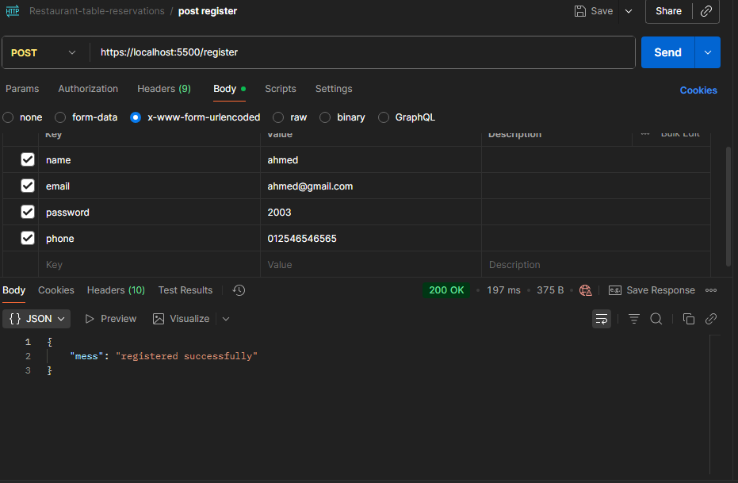 | 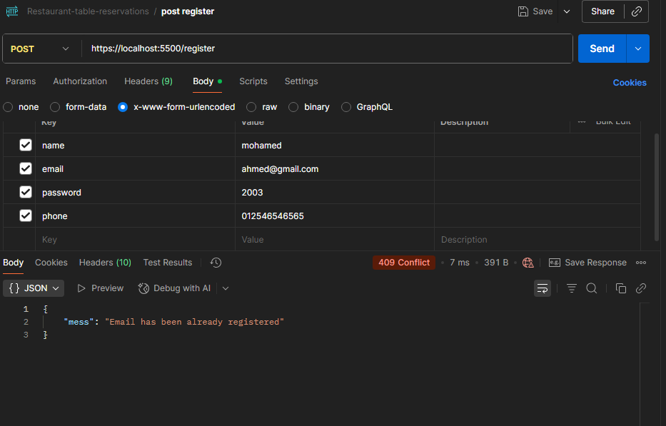 | 
 
| User Login | Invalid Credentials |
|----------|-------------|
| 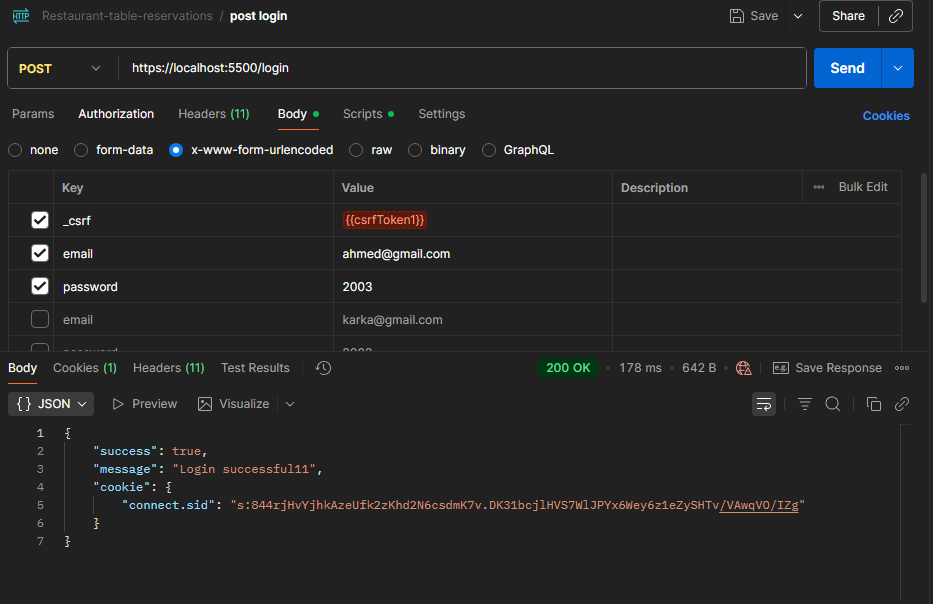 | 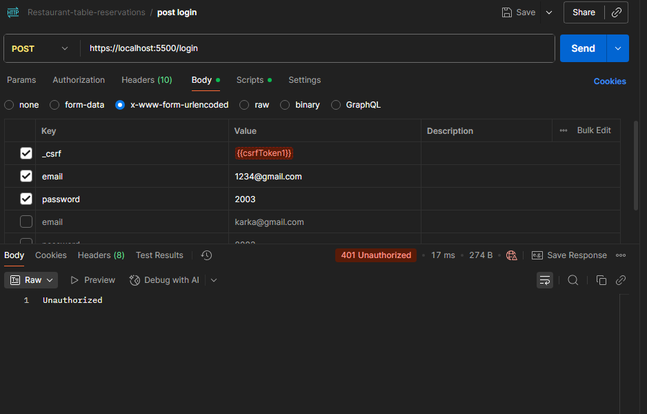 | 

| User Reservations | Cancelled Reservation |
|----------|-------------|
| 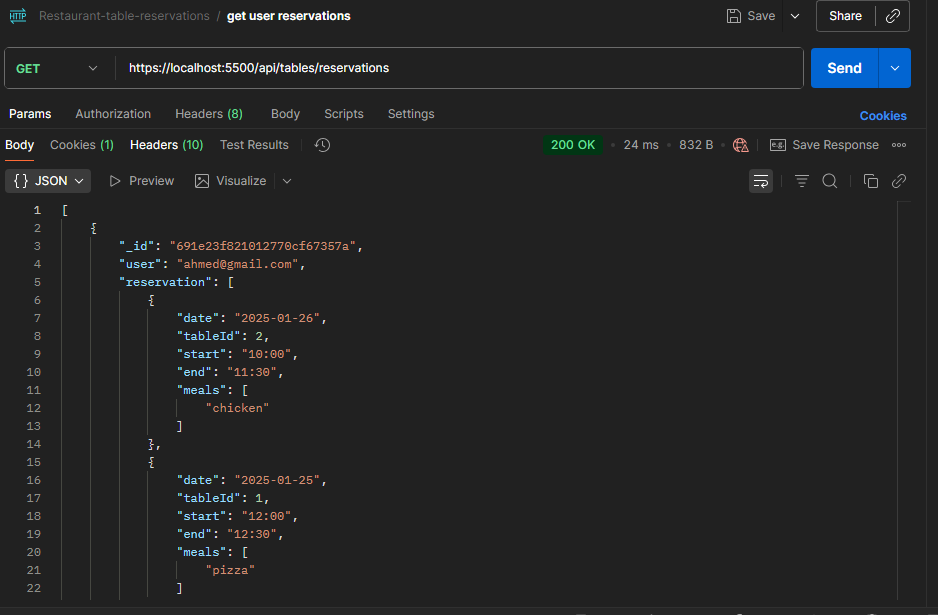 | 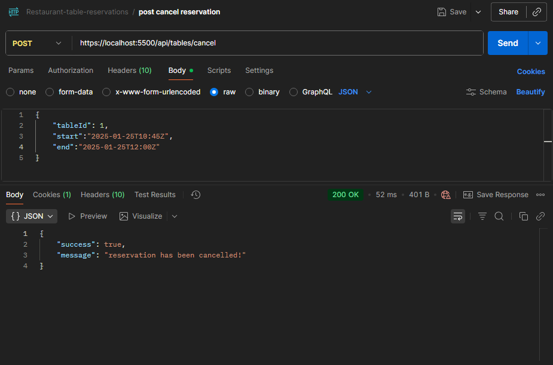 | 

| All Restaurant Tables | Successful Reservation |
|----------|-------------|
| 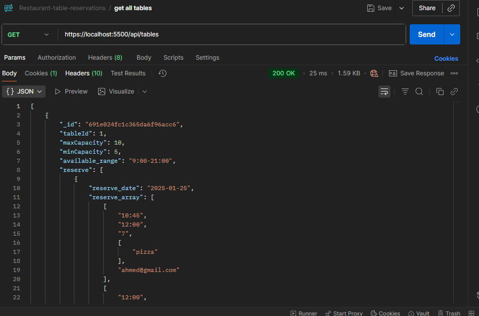 | 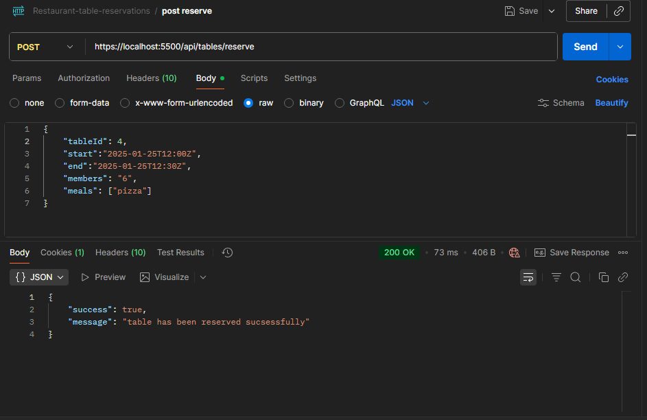 | 

| Unavailbale Time For Reservation | User Cancelling Reservation Which Is Not Reserved By Him |
|----------|-------------|
| 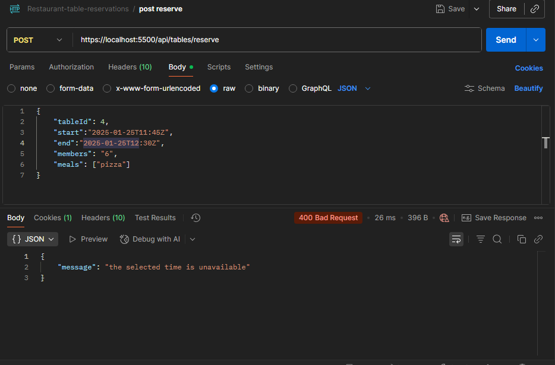 | 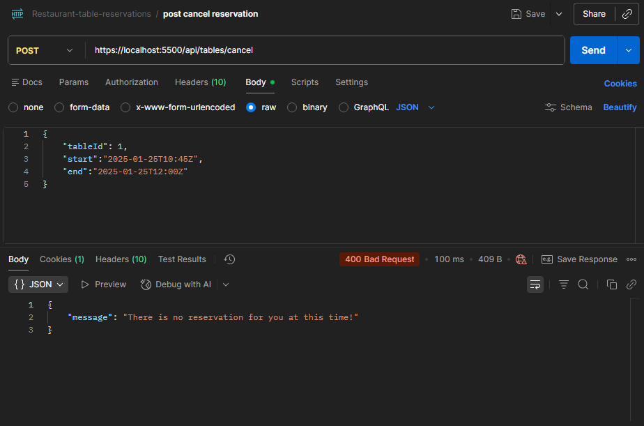 | 

| Available Slots For Table | 
|----------|
| 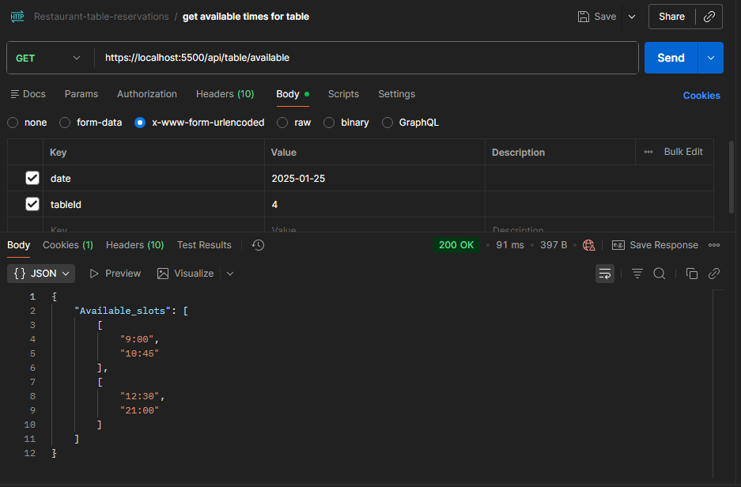 | 

                                                            
## Databse Structure:

| Collections | login-signup collection |
|----------|-------------|
| 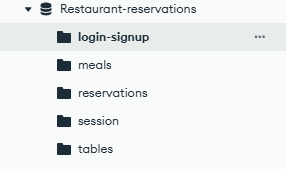 | 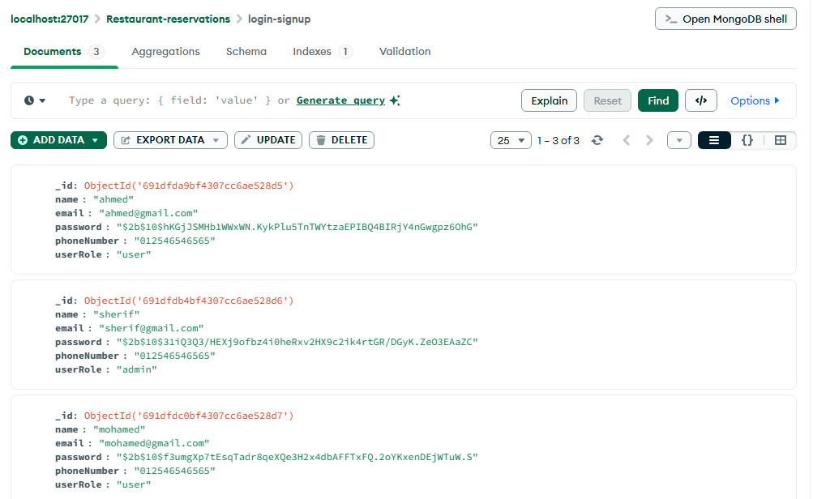 | 
 
| Meals Collection | Reservations Collection |
|----------|-------------|
| 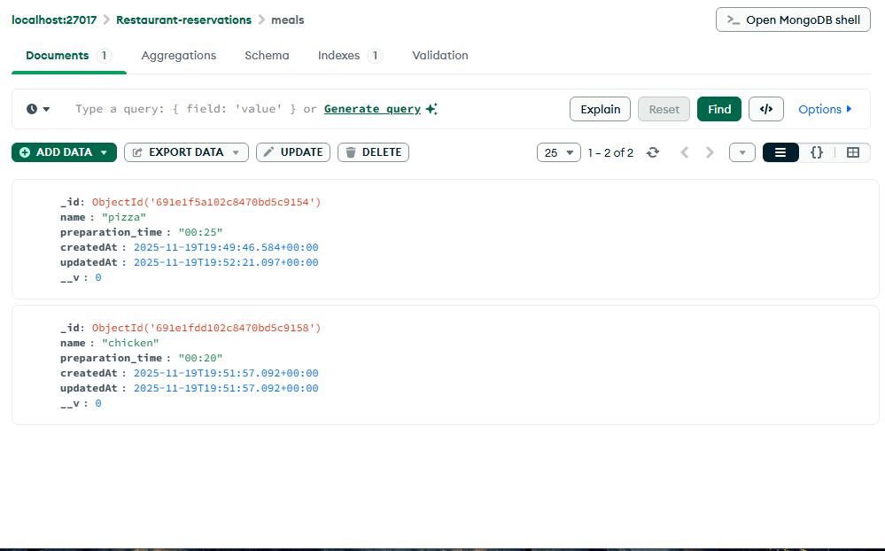 | 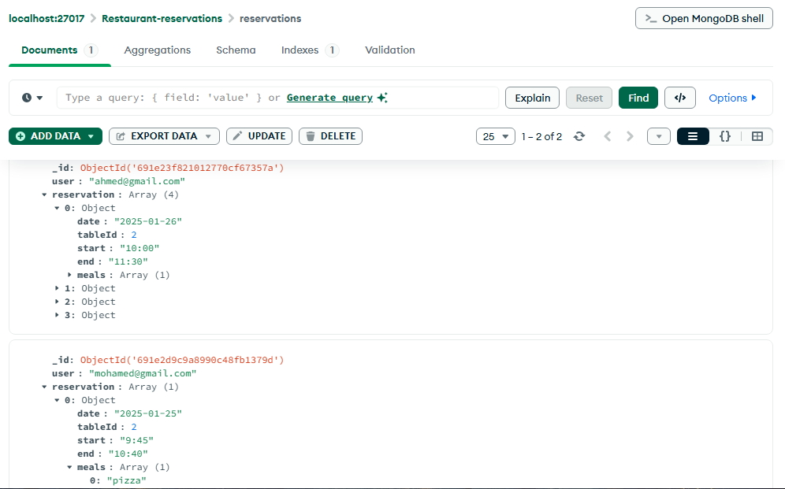 | 

| Tables Collection(1)  | Tables Collection(2) |
|----------|-------------|
| 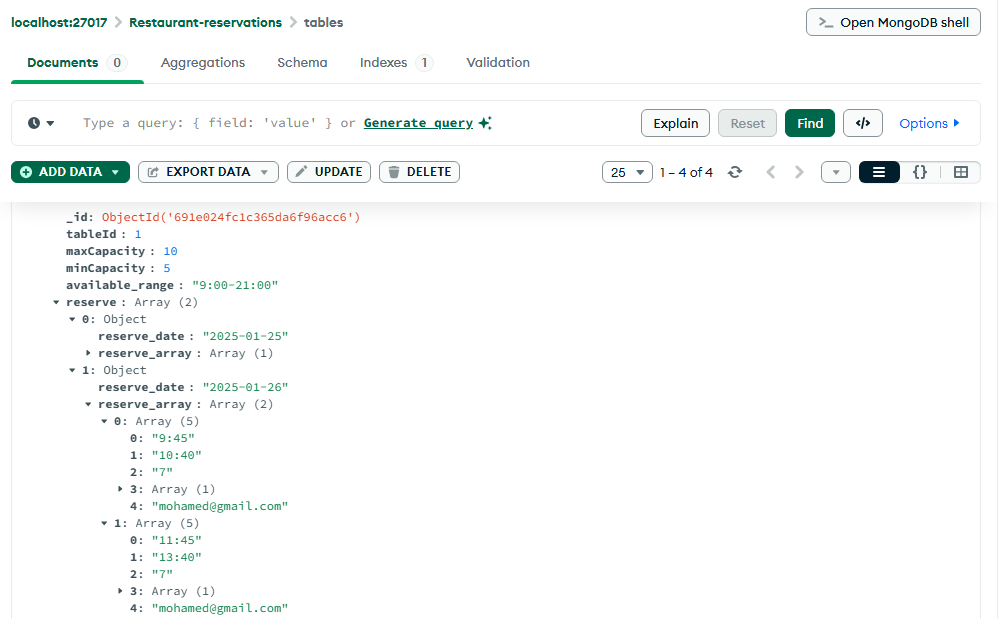 | 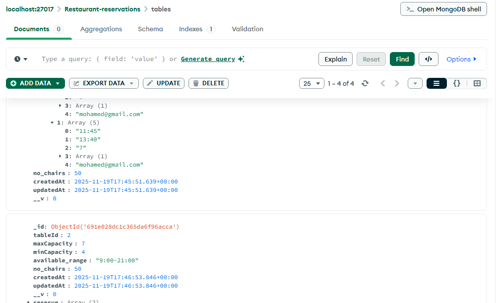 | 

## Admin Dashboard:

| Home | Create Table |
|----------|-------------|
|  |  | 
 
| User Login | Invalid Credentials |
|----------|-------------|
|  |  | 

| User Reservations | Cancelled Reservation |
|----------|-------------|
|  |  | 

| All Restaurant Tables | Successful Reservation |
|----------|-------------|
|  |  | 

| Unavailbale Time For Reservation | User Cancelling Reservation Which Is Not Reserved By Him |
|----------|-------------|
|  |  | 

| Available Slots For Table | 
|----------|
|  |  

🚀 Installation & Setup
1️⃣ Clone repository
git clone https://github.com/Sherif761/restaurant-reservation-system.git
cd restaurant-reservation-system

2️⃣ Install dependencies
npm install

3️⃣ Create .env
PORT=5000
MONGO_URI=your_mongo_connection_string
SESSION_SECRET=yourSecret
GOOGLE_CLIENT_ID=xxxx
GOOGLE_CLIENT_SECRET=xxxx
PAYMENT_API_KEY=xxxx

4️⃣ Start server
npm start

🧱 Technologies Used:

-> Node.js

-> Express.js

-> MongoDB + Mongoose

-> AdminJS

-> express-session

-> passport

-> Session + JWT

-> Bcrypt

-> Express-rate-limit

-> Helmet, CORS

🎯 Purpose of This Project:
This backend system is built as a practical demonstration of:

-> Building production-level backend architecture

-> Applying user authentication and authorization

-> Handling API's

-> Managing sessions securely

-> Creating an admin dashboard (CMS)

-> Handling security vulnerabilities

-> Designing modular code with controllers/services

-> Managing database using mongodb and mongoose drivers

🧑‍💻 Author

Sherif Hassan — Backend Developer
🌐 LinkedIn: www.linkedin.com/in/shrief-hassan-1a31a032b
📧 Email: shriefhassanali@gmail.com
